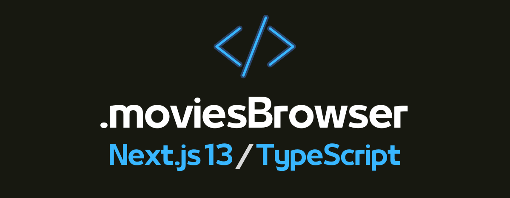

# Group project - Movies Browser



## Check the lastest version here: [Movies Browser](https://movie-browser-ts-next-js13.vercel.app/)

## Before you start

The project carves out a base version of a group project I had the pleasure of participating in ([Check it here](https://github.com/AllmostHumann/movie-browser)) . I used the time spent creating this version of the application to learn Next.js 13, TypeScript, Tailwindcss, TanStack Query. I also had the opportunity to use some interesting and helpful packages during development. Once the project will be completed, everything will be detailed in the description below.

Once I have created a counterpart to the original project, I also plan to add some improvements and additions, so I strongly encourage you to follow the changes!

Cheers!

## Introduction

A fully responsive movie browser that pulls data from the [MoviesDB](https://developers.themoviedb.org/3/getting-started) API. On the site, users can search using the implemented search engine for movies, actors, and crew.
The main page displays a list of the most popular movies in the form of tiles with basic data such as, poster, title, year of production, and category. To enter the details of a movie, just click on the selected tile. In the details you will find a description, list of actors, and crew.


The second tab is dedicated to the most popular actors. A list of actors by name is displayed in tile form. When you click on the selected tile, you will be taken to a page with details about the selected person, where you will see a list of films in which the actor played.


## Technologies

- Next.js 13,
- TypeScript,
- Tailwind Css,
- Tailwindcss-grid-areas,
- Axios,
- TanStack Query,
- classnames,
- Qs,
- SVGR webpack,
- React-player,
- React-modal

## Getting Started

First, run the development server:

```bash
npm run dev
# or
yarn dev
# or
pnpm dev
```

Open [http://localhost:3000](http://localhost:3000) with your browser to see the result.

You can start editing the page by modifying `app/page.tsx`. The page auto-updates as you edit the file.

[http://localhost:3000/api/hello](http://localhost:3000/api/hello) is an endpoint that uses [Route Handlers](https://beta.nextjs.org/docs/routing/route-handlers). This endpoint can be edited in `app/api/hello/route.ts`.

This project uses [`next/font`](https://nextjs.org/docs/basic-features/font-optimization) to automatically optimize and load Inter, a custom Google Font.

## Learn More

To learn more about Next.js, take a look at the following resources:

- [Next.js Documentation](https://nextjs.org/docs) - learn about Next.js features and API.
- [Learn Next.js](https://nextjs.org/learn) - an interactive Next.js tutorial.

You can check out [the Next.js GitHub repository](https://github.com/vercel/next.js/) - your feedback and contributions are welcome!

## Deploy on Vercel

The easiest way to deploy your Next.js app is to use the [Vercel Platform](https://vercel.com/new?utm_medium=default-template&filter=next.js&utm_source=create-next-app&utm_campaign=create-next-app-readme) from the creators of Next.js.

Check out our [Next.js deployment documentation](https://nextjs.org/docs/deployment) for more details.
